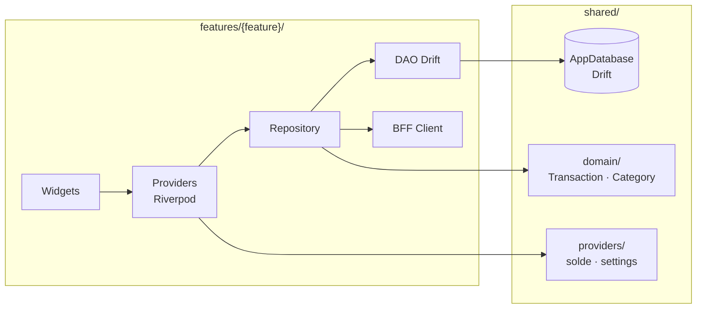
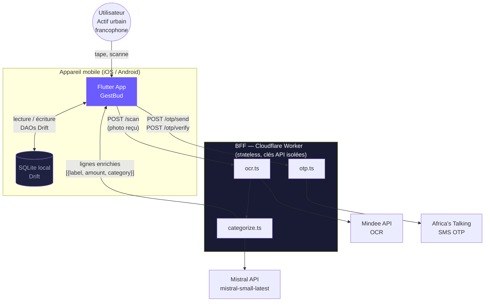
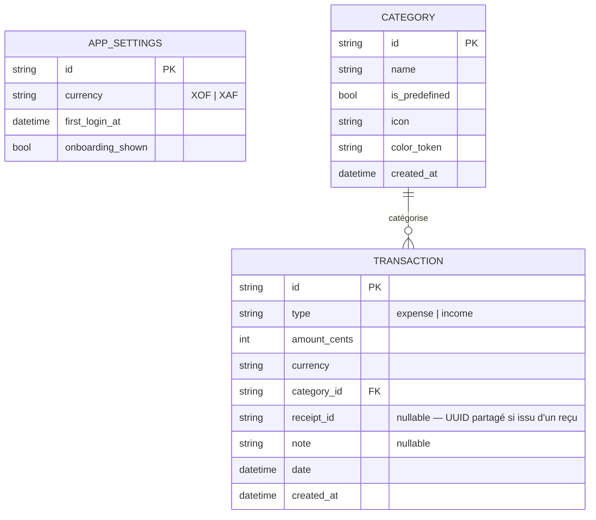

# Architecture Spine — GestBud

## Design Paradigme

**Reactive feature-based Flutter** : chaque feature est une tranche verticale autonome (widgets → providers Riverpod → repository → DAO Drift). L'état dérivé (Solde, agrégats) est calculé par des providers Riverpod, jamais stocké en base. Un BFF stateless (Cloudflare Worker) isole toutes les clés API tierces du binaire mobile ; l'app Flutter n'a aucun contact direct avec Mindee, Mistral ni Africa's Talking.



## Invariants & Règles

### AD-1 — État global uniquement via Riverpod

- **Binds :** toutes les features
- **Prevents :** `setState` ou `InheritedWidget` pour l'état partagé ; état dupliqué entre features
- **Rule :** tout état visible par plus d'un widget passe par un provider Riverpod déclaré dans le dossier `providers/` de sa feature ou dans `shared/providers/`. Le Solde et les agrégats du Tableau de bord sont des `Provider` dérivés (jamais persistés en base).

---

### AD-2 — Structure feature-based avec shared/ comme frontière

- **Binds :** organisation du code `lib/`
- **Prevents :** couplage direct entre features (ex. `scan/` importe depuis `dashboard/`)
- **Rule :** une feature n'importe jamais depuis une autre feature. Les entités, providers et widgets partagés vivent dans `shared/`. La communication inter-feature passe par les providers de `shared/providers/`.

---

### AD-3 — Drift ORM pour tout accès SQLite

- **Binds :** FR-22, FR-23, schéma local
- **Prevents :** requêtes SQL en string brut, migrations manuelles, accès direct via `sqflite`
- **Rule :** tout accès à la base locale passe par des DAOs Drift générés (`TransactionDao`, `CategoryDao`, `SettingsDao`). Le schéma inclut `currency TEXT NOT NULL DEFAULT 'XOF'` sur `app_settings` dès V1. Le champ `receipt_id TEXT` est nullable sur `transactions` : null pour les saisies manuelles, UUID partagé pour les lignes d'un même reçu. Les insertions de plusieurs lignes d'un même reçu s'effectuent dans un bloc `database.transaction()` unique — atomicité garantie, aucun événement stream intermédiaire partiel visible par `soldeProvider`.

---

### AD-4 — BFF Cloudflare Worker : aucune clé API dans le binaire

- **Binds :** FR-1, FR-2, FR-3, FR-9, FR-10, FR-12
- **Prevents :** clés Mindee, Mistral ou Africa's Talking embarquées dans l'APK/IPA
- **Rule :** l'app Flutter n'appelle que le BFF (URL injectée via `--dart-define=BFF_URL`, voir AD-13). Le BFF orchestre le pipeline scan : Mindee v2 (soumission async → polling de l'endpoint `/jobs/<jobId>` jusqu'à résolution) → Mistral batch → réponse unique `[{label, amount_cents, category}]` à l'app. Le BFF est stateless — aucune donnée utilisateur n'y transite ni n'y est stockée au-delà de la requête. La photo de reçu n'est pas conservée après l'appel Mindee (voir AD-13 et Deferred : rétention Mindee).

---

### AD-5 — Catégorisation : Mistral batch via BFF + fallback dictionnaire

- **Binds :** FR-10, FR-11 ; interface `CategorizationService`
- **Prevents :** appels LLM ligne par ligne (latence), logique de catégorisation couplée au provider scan
- **Rule :** le BFF envoie toutes les lignes OCR en un seul prompt Mistral. Le format de réponse au client Flutter est `[{label: string, amount_cents: int, category: string}]` — `amount_cents` est en centimes (jamais en unités d'affichage FCFA). Si l'appel Mistral échoue ou dépasse le timeout, le BFF applique un dictionnaire de mots-clés de repli et retourne `category: "Autre"` pour les lignes non reconnues. L'app Flutter ne distingue pas les deux chemins.

---

### AD-6 — Navigation déclarative via GoRouter

- **Binds :** FR-24, flux auth, deep links futurs
- **Prevents :** `Navigator.push` impératif pour les routes principales, logique de redirection dispersée
- **Rule :** toutes les routes nommées sont déclarées dans `shared/routing/app_router.dart`. La garde auth (redirection vers `/auth` si session absente) est définie dans le `redirect` de GoRouter, pas dans les widgets.

---

### AD-7 — Session token dans flutter_secure_storage

- **Binds :** FR-2, FR-4
- **Prevents :** token stocké dans `SharedPreferences` ou la base Drift (non chiffrés)
- **Rule :** le token de session OTP est lu et écrit exclusivement via `flutter_secure_storage` (Keychain iOS / Keystore Android). Les données de transactions restent dans Drift après déconnexion ; seul le token est effacé (correction du PRD qui mentionne "localStorage", concept web inapplicable en mobile natif).

---

### AD-8 — Montants stockés en centimes entiers

- **Binds :** schéma Drift, providers, affichage
- **Prevents :** erreurs d'arrondi floating-point sur les calculs de Solde ; représentations mixtes (double vs int)
- **Rule :** tout montant est stocké en `INTEGER` (centimes XOF, ex. 1 500 FCFA → 150 000 centimes). La couche d'affichage divise par 100 avec séparateur espace fine. Jamais de `double` pour un montant financier.

---

### AD-10 — TransactionRepository dans shared/ : unique point d'écriture des Transactions

- **Binds :** features/scan/, features/transactions/, shared/data/
- **Prevents :** deux features écrivant indépendamment dans TransactionDao (insertions concurrentes, génération UUID dupliquée, stream events partiels du solde)
- **Rule :** `shared/data/transaction_repository.dart` est le seul endroit qui appelle `TransactionDao.insert()` ou `TransactionDao.delete()`. `features/transactions/` l'utilise pour les saisies manuelles. `features/scan/` valide les lignes puis délègue en bloc via `TransactionRepository.insertReceiptLines(receiptId, lines)` — jamais d'appel direct à `TransactionDao` depuis une feature.

---

### AD-11 — CategoryDao : seeding unique dans AppDatabase.onCreate ; un seul provider stream

- **Binds :** shared/data/, shared/providers/, features/categories/
- **Prevents :** double seeding des catégories prédéfinies (violation unicité) ou absence de seeding (liste vide cassant transactions/ et scan/) ; deux streams Drift concurrents sur CategoryDao
- **Rule :** `AppDatabase.onCreate` est le seul point qui insère les catégories prédéfinies (idempotent via `insertOrIgnore`). `shared/providers/categoryListProvider` est le seul `StreamProvider` sur `CategoryDao.watchAll()` — toutes les features le lisent via `ref.watch`, aucune n'ouvre son propre stream Drift sur les catégories.

---

### AD-12 — sessionStateProvider : seule entrée du guard GoRouter ; bootstrap FSS explicite

- **Binds :** features/auth/, shared/routing/, shared/providers/
- **Prevents :** race condition async entre `flutter_secure_storage` (lecture async) et la fonction `redirect` de GoRouter (doit être synchrone ou attendre un provider) ; deux implémentations incompatibles du guard de session
- **Rule :** `shared/providers/session_provider.dart` expose un `AsyncNotifierProvider<SessionState>` qui lit `flutter_secure_storage` une seule fois au démarrage. `main.dart` attend la résolution de ce provider (via `ProviderContainer.read` + `Future`) avant de monter le `MaterialApp`. La fonction `redirect` de GoRouter lit uniquement `ref.watch(sessionProvider)` — jamais FSS directement.

---

### AD-13 — BFF URL via --dart-define ; environnements Wrangler 4.x

- **Binds :** shared/network/bff_client.dart, BFF wrangler.toml
- **Prevents :** URL BFF hardcodée dans l'app ; divergence dev/prod sur les deux côtés (Flutter et Worker)
- **Rule :** l'URL BFF est injectée à la compilation Flutter via `--dart-define=BFF_URL=https://...` et lue dans `bff_client.dart` via `String.fromEnvironment('BFF_URL')`. Le BFF définit deux environnements dans `wrangler.toml` (Wrangler 4.x) : `[env.dev]` (local, `wrangler dev`) et `[env.prod]`. Les clés API tierces vivent dans les secrets Wrangler (`wrangler secret put`) en prod et dans `.dev.vars` en dev — jamais en clair dans `wrangler.toml`.

---

### AD-14 — Devise configurable depuis V1

- **Binds :** NFR internationalisation, FR-17 à FR-21
- **Prevents :** `'XOF'` hardcodé dans les providers ou les widgets ; migration cassante lors de l'ajout XAF en V2
- **Rule :** la devise active est lue depuis `AppSettings.currency` (Drift). Les providers de calcul (Solde, postes) reçoivent la devise du `settingsProvider`. Aucun provider ne référence `'XOF'` en dur.

---

## Conventions de cohérence

| Préoccupation | Convention |
|---|---|
| Nommage fichiers | `snake_case.dart` ; un fichier = une classe principale |
| Nommage classes/providers | `PascalCase` ; providers suffixés `Provider` (ex. `soldeProvider`) |
| IDs entités | UUID v4 (`dart:uuid`) — jamais auto-increment SQLite comme identifiant externe |
| Dates stockées | `INTEGER` (millisecondes depuis epoch) dans Drift ; `DateTime` en Dart |
| Dates affichées | `JJ/MM/AAAA` (intl, locale `fr`) |
| Montants affichés | `245 800 FCFA` — espace fine insécable comme séparateur de milliers, devise en `caption` |
| Forme des erreurs | `sealed class Failure` : `NetworkFailure`, `OcrFailure`, `DatabaseFailure`, `AuthFailure` |
| Mutation de données | Seul le Repository écrit en base via DAO ; les providers écoutent via `Stream` Drift (réactivité automatique) |
| Appels réseau | Toujours via `BffClient` (`shared/network/bff_client.dart`) — jamais d'appel HTTP direct vers Mindee/Mistral/AT dans une feature |
| Signe des montants affichés | Préfixe `−` Dépense, `+` Revenu (la couleur seule ne suffit pas — accessibilité daltonisme) |

## Stack

| Composant | Version |
|---|---|
| Flutter SDK | ^3.22 |
| Dart | ^3.4 |
| flutter_riverpod | ^3.3.2 ¹ |
| drift + drift_flutter | ^2.x ² |
| go_router | ^14.8.0 |
| flutter_secure_storage | ^10.3.1 |
| Cloudflare Workers runtime | v8 (Wrangler 4.x) |
| Mindee API | v2 (async polling) |
| Mistral API | mistral-small-latest (→ Mistral Small 4) |
| Africa's Talking SMS API | v1 |

*¹ Vérifier la disponibilité stable sur pub.dev avant `flutter pub add` (3.3.2 peut être pre-release).*
*² Exact patch version à confirmer sur pub.dev — la série 2.x est active.*

## Seed structurel

```text
gestbud/
  lib/
    features/
      auth/                 ← flux OTP, vérification session au démarrage
        providers/
        repository/
        screens/
      scan/                 ← caméra, appel BFF, correction lignes, validation reçu
        providers/
        repository/
        screens/
        widgets/            ← ReceiptLineRow, ScanLoadingSkeleton
      transactions/         ← saisie manuelle, historique, modification, suppression
        providers/
        screens/
        widgets/
      dashboard/            ← solde, postes catégories, graphique, sélection période
        providers/          ← soldeProvider (dérivé), postesProvider (dérivé)
        screens/
        widgets/
      categories/           ← liste, création, renommage, suppression custom
        providers/
        repository/
        screens/
    shared/
      data/                 ← AppDatabase (Drift), TransactionDao, CategoryDao, SettingsDao
                              transaction_repository.dart (AD-10 — seul écrivain Transactions)
      domain/               ← Transaction, Category, AppSettings (modèles Dart purs)
      providers/            ← settingsProvider, categoryListProvider (AD-11), sessionProvider (AD-12)
      routing/              ← app_router.dart (GoRouter + garde auth sur sessionProvider)
      network/              ← bff_client.dart (URL via BFF_URL dart-define, AD-13)
      widgets/              ← CategoryBadge, TransactionRow, AmountDisplay, EmptyState
    main.dart
  bff/                      ← Cloudflare Worker TypeScript (déployé séparément)
    src/
      handlers/
        ocr.ts              ← appel Mindee, parse réponse
        categorize.ts       ← appel Mistral batch + fallback dictionnaire
        otp.ts              ← appel Africa's Talking
      index.ts              ← routing des handlers, CORS
    wrangler.toml
```

### Diagramme de contexte système



### ERD — Entités principales



## Capability → Architecture Map

| Capability / FR | Vit dans | Régi par |
|---|---|---|
| FR-1 à FR-4 — Authentification OTP | `features/auth/` + `bff/handlers/otp.ts` | AD-4, AD-6, AD-7, AD-12, AD-13 |
| FR-5 à FR-8 — Saisie manuelle Dépense / Revenu | `features/transactions/` + `shared/data/transaction_repository.dart` | AD-1, AD-2, AD-3, AD-8, AD-10 |
| FR-9 à FR-12 — Scan Reçu + OCR + correction + groupement | `features/scan/` + `bff/handlers/ocr.ts` + `bff/handlers/categorize.ts` + `shared/data/transaction_repository.dart` | AD-3 (receipt_id + transaction()), AD-4, AD-5, AD-10 |
| FR-13 à FR-16 — Gestion Catégories | `features/categories/` + `shared/data/` + `shared/providers/categoryListProvider` | AD-2, AD-3, AD-11 |
| FR-17 à FR-21 — Tableau de bord | `features/dashboard/` + `shared/providers/` | AD-1 (providers dérivés), AD-14 |
| FR-22 à FR-23 — Stockage local + avertissement | `shared/data/` | AD-3, AD-11 |
| FR-24 — Navigation unifiée | `shared/routing/` | AD-6, AD-12 |
| NFR — Devise configurable (XAF V2) | `shared/data/` + `shared/providers/` | AD-9 |
| NFR — Environnements dev / prod | `bff/wrangler.toml` + `shared/network/bff_client.dart` | AD-13 |

## Différé

- **Chiffrement SQLCipher** — La sandbox OS protège les données en beta ; SQLCipher à évaluer en V2 pour les appareils rootés/jailbreakés.
- **Apprentissage IA des corrections** — Dataset insuffisant en V1 ; à envisager en V2 si SM-4 révèle un taux de correction > 40 %.
- **Backup / export JSON** — Risque de perte accepté en beta avec l'avertissement FR-23 ; priorité V2 si signalé par les 20 beta.
- **Implémentation locale XAF** — Schéma currency-ready dès V1 (AD-14) ; la locale Dart et l'UI de sélection de devise sont V2.
- **Swap de fournisseur LLM** — Interface côté BFF ; changer de fournisseur ne touche pas l'app Flutter.
- **Stratégie de tests** — Baseline : repositories testés avec `driftTestExecutor` (in-memory, pas de mocks), handlers BFF testés avec Miniflare. Couverture widget et intégration scan à définir au niveau epic.
- **Distribution beta** — TestFlight (iOS) + Firebase App Distribution (Android) pour les 20 beta-testeurs. Hors scope architecture.
- **⚠ Rétention photos Mindee — BLOQUANT BETA (PRD Q-4)** — Vérifier la politique de rétention de Mindee v2 avant le lancement beta. Si les images sont conservées, activer l'option no-data-retention ou obtenir un engagement contractuel. Décision requise avant mise en production.
- **Notifications push** — Hors périmètre MVP (PRD §7).
- **Multi-devises simultanées** — Une seule devise active par session ; multi-devise à modéliser en V2.
